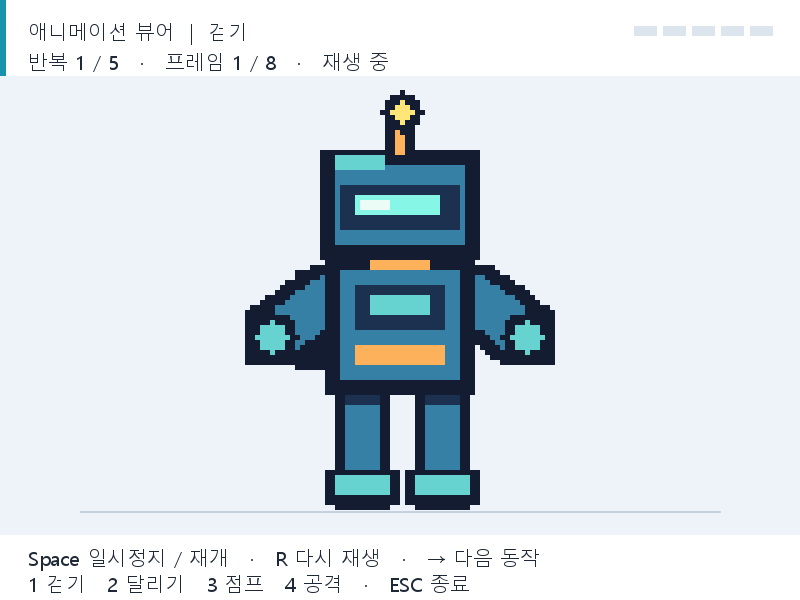

# Drill #8 — 애니메이션 뷰어

`drill08-animation-viewer` 브랜치에서 작업한 제출용 프로그램입니다.
소스 파일은 **`LEC08/animation_viewer.py`**입니다.
기존 프로젝트에서 사용하던 `Robot_sprite_sheet.png`의 네 가지 동작을 재생합니다.



## 실행 방법

프로젝트 루트에서 실행합니다. Python 3.10 이상을 권장하며,
Python 3.13.15와 Pico2D 1.5.1에서 실행을 확인했습니다.

```powershell
python -m pip install -r LEC08/requirements.txt
python LEC08/animation_viewer.py
```

VS Code에서 `LEC08/animation_viewer.py`를 열고 실행해도 됩니다.
`Labs/LEC08_Animation/animation_viewer.py`도 같은 제출용 프로그램으로 연결됩니다.
이미지는 소스 파일 위치를 기준으로 읽으므로 다른 폴더에서 실행할 수 있습니다.

## 과제 조건과 구현

| 조건 | 구현 내용 |
| --- | --- |
| 스프라이트 시트 사용 | 기존 로봇 시트 650×422픽셀 사용 |
| 애니메이션 4종 이상 | 걷기, 달리기, 점프, 공격 |
| 화면 중앙 재생 | 로봇 몸통의 기준점을 가로 중앙에 고정 |
| 확대 표시 | 원본의 5배, 표시 높이 310~420픽셀로 600픽셀 화면의 절반 이상 |
| 각 애니메이션 5회 반복 | 모든 프레임을 끝까지 재생한 것을 1회로 계산 |
| 반복 후 1초 정지 | 5회째 마지막 프레임을 유지하고 정확히 1초 뒤 다음 동작으로 전환 |
| 전체 무한 반복 | 걷기 → 달리기 → 점프 → 공격 → 걷기 순서로 계속 재생 |
| 파일명과 폴더 | `LEC08/animation_viewer.py` |
| 별도 작업 이력 | `drill08-animation-viewer` 브랜치, 구체적인 한국어 커밋 20개 이상 |

### 추가점수 구현 내용 — 제출 시 함께 기재

**프레임마다 크기가 다른 복잡한 스프라이트 시트를 지원합니다.**
27개 프레임 각각의 `left`, `top`, `width`, `height`를 실제 픽셀 경계에 맞게 지정했습니다.
폭은 52~95픽셀, 높이는 62~84픽셀로 서로 다릅니다.
`anchor_x`, `anchor_y`를 사용해 자르는 크기가 달라도 몸통 위치를 유지하고,
점프의 공중 위치와 공격 무기의 긴 효과까지 표시합니다.

**애니메이션마다 프레임 수가 서로 다른 경우를 지원합니다.**
각 동작의 프레임 목록 길이를 사용하므로 빈 칸이나 옆 동작을 재생하지 않습니다.

| 동작 | 프레임 수 | 프레임당 시간 | 5회 재생 시간 | 재생 후 정지 |
| --- | ---: | ---: | ---: | ---: |
| 걷기 | 8 | 0.12초 | 4.8초 | 1초 |
| 달리기 | 6 | 0.08초 | 2.4초 | 1초 |
| 점프 | 6 | 0.12초 | 3.6초 | 1초 |
| 공격 | 7 | 0.10초 | 3.5초 | 1초 |

자동 재생의 전체 한 순환은 **18.3초**입니다.
수동 일시정지 또는 동작 선택을 하면 해당 조작에 따라 재생 일정이 달라집니다.

## 조작 방법

| 키 | 기능 |
| --- | --- |
| Space | 현재 프레임과 시간을 보존하며 일시정지 / 재개 |
| 1 / 2 / 3 / 4 | 걷기 / 달리기 / 점프 / 공격을 처음부터 재생 |
| R | 현재 동작의 5회 반복을 처음부터 다시 시작 |
| 오른쪽 화살표 | 다음 동작을 처음부터 재생 |
| Esc / 창 닫기 | 프로그램 종료 |

숫자, R, 오른쪽 화살표로 선택하면 일시정지가 해제됩니다.
상단에는 동작 이름, 반복 횟수, 현재 프레임, 정지 상태가 표시됩니다.
오른쪽의 표시 5개는 완료한 반복 횟수만큼 채워집니다.

## 검증 방법

추가 테스트 패키지 없이 프로젝트 루트에서 실행합니다.

```powershell
python -m unittest discover -s LEC08 -p "test_*.py" -v
```

- 재생 시간 테스트 9개: 전체 프레임 순서, 5회 반복, 정확한 1초 경계,
  18.3초 순환, 갱신 지연, 일시정지, 동작 선택 등을 검사합니다.
- 이미지 테스트 5개: PNG의 알파 채널을 읽어 모든 불투명 픽셀이
  정확히 한 프레임에 포함되는지 검사합니다. 자르기 영역, 화면 경계,
  5배 확대, 최소 표시 높이도 확인합니다.
- 실제 Pico2D 실행으로 전체 순환과 정지 시간을 확인했고,
  Space, 숫자 선택, R, 오른쪽 화살표, Esc, 창 닫기와 기존 실습 경로의 실행을 확인했습니다.
- `preview.png`는 실제 렌더링 화면입니다.

## 브랜치와 커밋 확인

VS Code 왼쪽 아래에서 `drill08-animation-viewer` 브랜치를 확인할 수 있습니다.
터미널에서는 다음 명령으로 현재 브랜치와 이번 과제의 한국어 작업 이력을 확인합니다.

```powershell
git branch --show-current
git log --reverse --oneline 7a6c200..drill08-animation-viewer
git rev-list --count 7a6c200..drill08-animation-viewer
```

기준 커밋 `7a6c200` 이후에 실제 소스, 프레임 데이터, 기능, 테스트,
설명서를 단계별로 저장했습니다. 제출 시 이 브랜치의 `LEC08` 폴더와
위의 추가점수 구현 설명을 함께 제시하면 됩니다.
